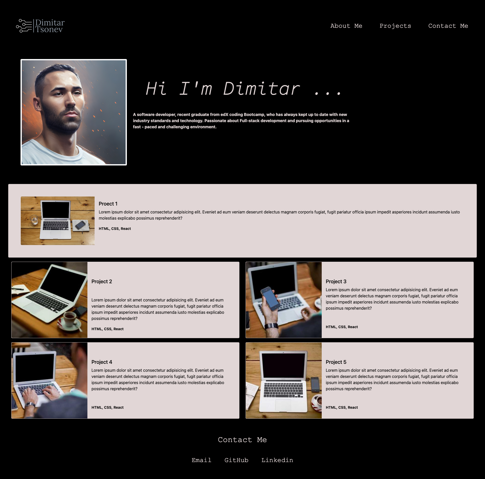

# Bootstrap-Portfolio

## Overview

This project focuses on building a portfolio layout using the Bootstrap CSS Framework. It encompasses various elements of web development, including HTML, CSS, GitHub, GitHub Pages, and Bootstrap.

## Instructions

1. **Create a new repository on GitHub** named Bootstrap-Portfolio.
2. **Clone the repository** to your local computer.
3. **Folder Structure**:
   - Create an `index.html` file.
   - Establish a `css` folder containing a `style.css` file.
   - Create an `images` folder for image assets.
4. Utilize Bootstrap to create your portfolio site, including:
   - **Navigation Bar**:
     - Utilize Bootstrap's navigation menu or create a customized one using Bootstrap classes.
     - Include appropriate links for navigation.
   - **Hero Section**:
     - Feature a jumbotron displaying your image, name, and additional information.
   - **Work Section**:
     - Display projects in a grid layout using Bootstrap cards.
     - Provide brief project overviews and links to class project work.
   - **Skills Section**:
     - List expected skills to be learned from the bootcamp.
   - **About/Contact Section**:
     - Include an "About Me" section.
   - **Footer Section**:
     - Ensure hover effects for hyperlinks and buttons displaying a box shadow.

5. **Minimize media queries** in your Bootstrap solution.
6. **Deploy your Bootstrap-powered portfolio** on GitHub Pages.

## The Technologies used
- **HTML5**
- **CSS3**
- **Bootstrap**
- **Git and GitHub**

Link to  <a href="https://github.com/D-Tsonev/Bootstrap-Portfolio">Repository</a>

Link to  <a href="https://d-tsonev.github.io/Bootstrap-Portfolio/">GitHub Page</a>

